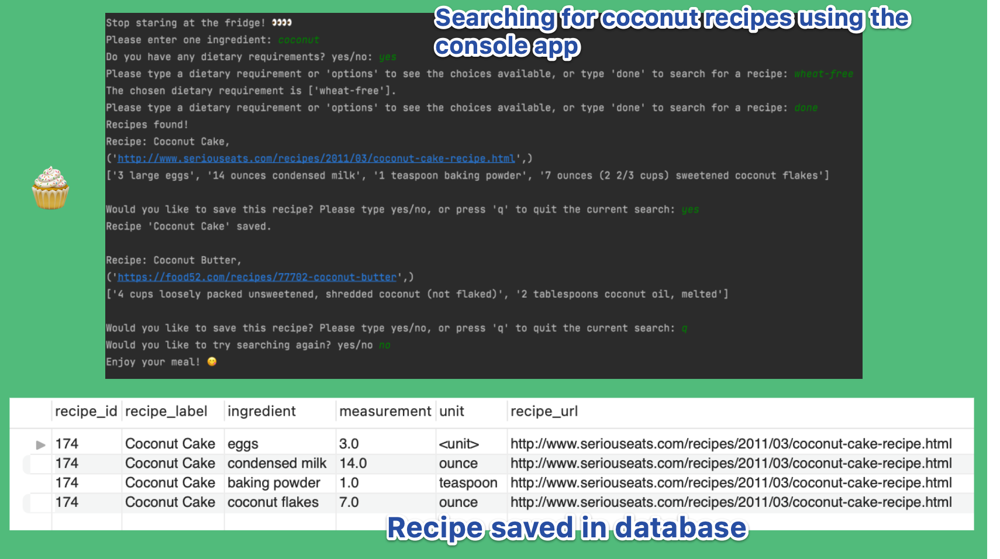
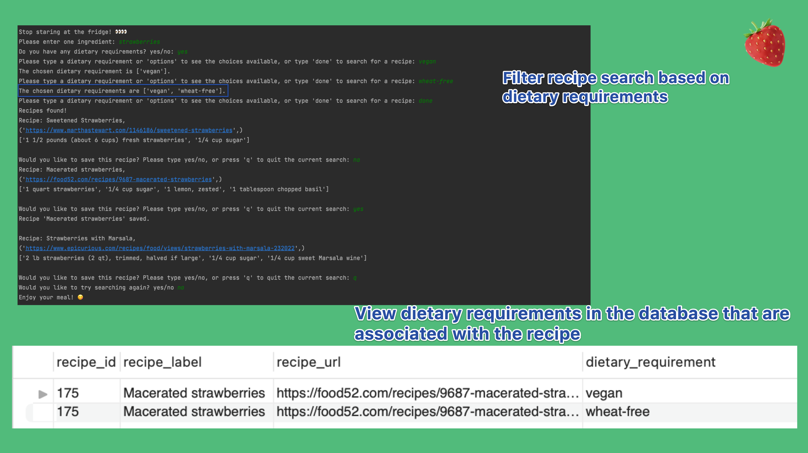

# Stop Staring at the Fridge! Search and save recipes based on the ingredient you have.
This project was created as part of the Code First Girls SQL and Database course. It builds on a console app I created as part of a Code First Girls python course that searches for recipes using the Edamam API, and allows the user to save their recipes to the database.

## General Information
- Provide general information about your project here.
- What problem does it (intend to) solve?
- What is the purpose of your project?
- Why did you undertake it?
<!-- You don't have to answer all the questions - just the ones relevant to your project. -->

## Features

- Filter the recipe search with dietary requirements. 
- The dietary requirements chosen are saved along with the recipe in the database.
- Select and filter recipes from your database using stored functions and procedures.

## Screenshots

## Setup

Please add 'app_id' and 'add_key' credentials from your Edamam account to the recipe_api_request.py file:
https://developer.edamam.com/edamam-recipe-api

Please see the database_setup/create-db.sql file for creating the database in MySQL Workbench. 
The database connection details for your database will need to be inputted in the mydb section of the edamam_search.py file.

## Acknowledgements
Many thanks to  for their courses and the encouragement to create my own projects.
