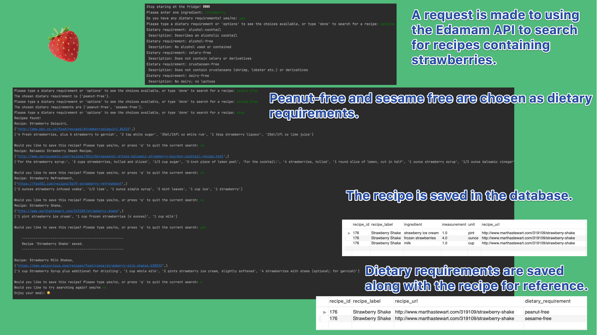

# Stop Staring at the Fridge! Search and save recipes based on the ingredient you have.
This project was created as part of the Code First Girls SQL and Database course. It builds on [a console app](https://github.com/francesg-code/recipeSearch) I created as part of a Code First Girls python course. The user can now save recipes found using the [Edamam API](https://www.edamam.com/) to a database.

## General Information
This project helps with those times when there's not much in the fridge and it's difficult to decide what to make. Users can search for recipes based on the ingredient they have and filter those recipes by any dietary requirements too. Each recipe result contains a link to the recipe's webpage, and a brief summary of the other ingredients needed. The recipe can be saved to a personal database. As the user's database grows, they can search their own saved recipes using different criteria such as dietary requirements or complexity.

## Features

- Filter the recipe search with dietary requirements. 
- If a recipe is saved in the database, the dietary requirements chosen are saved along with it.
- Select and filter recipes from your database using stored functions and procedures noted in the database setup file.

## Screenshots

## Setup

Please add 'app_id' and 'add_key' credentials from your Edamam account to the recipe_api_request.py file:
https://developer.edamam.com/edamam-recipe-api

Please see the database_setup/create-db.sql file for creating the database in MySQL Workbench. 
The database connection details for your database will need to be inputted in the mydb section of the edamam_search.py file.

## Acknowledgements
Many thanks to [Code First Girls](https://codefirstgirls.com/) for their courses and the encouragement to create my own projects.
